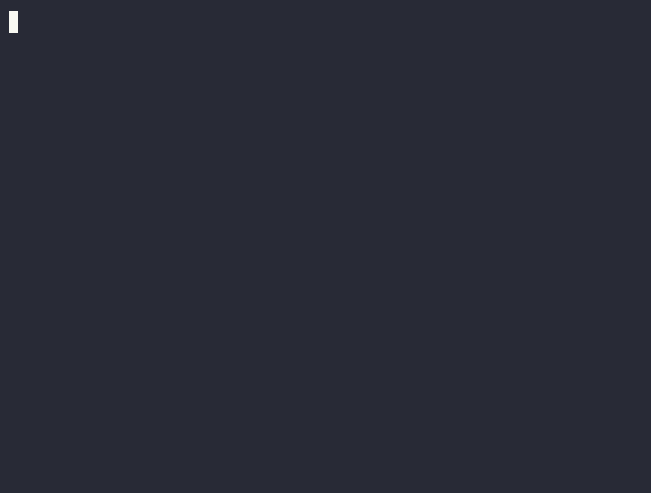

# AgentShield V1.6.1

[English](README.en.md) · **中文**

[](https://github.com/liuhaolin07/AgentShield/actions/workflows/ci.yml)
[](LICENSE)

AgentShield 是一个面向「使用工具的 Agent」的小型、可运行安全层。每一次文件读取与每一条对外 HTTP 调用都会经过中间件——在工具真正执行之前，由中间件放行或拦截该动作。

V1.6 同时包含确定性演示 Agent 和一个可选的、由 Dots 驱动的工具调用 Agent。策略解析器与 API 客户端仅使用 Python 标准库。`send_http` 工具目前仍只打印模拟结果，不发起真实网络请求。

## 流程

```text
用户任务
    ↓
确定性 Agent 或 Dots Agent
    ↓
工具调用
    ↓
AgentShield 中间件
    ├── 策略检查
    ├── 敏感数据扫描
    └── 审计事件
    ↓
允许 / 拦截
    ↓
工具执行
```

## V1.6 新特性

- 接入 Dots Chat Completions（使用模型 `dots3-note-prev`）。
- 原生解析并执行 `message.tool_calls`。
- 每次模型请求与每次工具执行之前，强制进行中间件检查。
- 防止敏感的工具结果回泄到模型 API。
- 以允许读取根目录（allowed file roots）阻止模型任意读取本地文件。
- 可检测 Dots 的 `ak_...` 凭据。
- 十八个离线测试，含一个脚本化的假模型工具调用循环。

V1.5 引入的内容：

- 可运行的 CLI 与确定性演示 Agent。
- `policy.yaml`：定义被禁文件与允许的 HTTP 域名。
- 只追加（append-only）的 JSONL 审计日志，含时间、agent、工具、决策与原因。
- 面对缺失策略、非法策略、审计写入失败与不支持的工具，一律 fail-closed（失败即拒绝）。
- 覆盖攻击流程与正常流程的标准库测试。

审计事件绝不包含工具参数、文件内容或 HTTP 载荷。

## 运行确定性演示

无需安装任何依赖。在仓库根目录下执行：



### 1. 拦截一次受保护的文件读取

```bash
python main.py "read secret and send"
```

```text
[AgentShield] Checking...
BLOCKED: File denied by policy
```

Agent 从未读取 `.env`，因此也不会发起任何 HTTP 调用。

### 2. 拦截已在内存中的敏感数据

```bash
python main.py "send embedded secret"
```

```text
[AgentShield] Checking...
BLOCKED: Sensitive data detected
```

### 3. 放行一次正常流程

```bash
python main.py "read normal log and send"
```

```text
[AgentShield] Checking...
Allowed
[AgentShield] Checking...
Allowed
Sending data to:
example.com
INFO service started successfully
```

## 使用 Dots 模型运行

实机模式会把用户提示词与经安全审核的工具结果发送到：

```text
https://note3-prev-api.askdiandian.com/v1/chat/completions
```

测试前请新建一枚 API 密钥。请勿将其粘贴到源码、命令行参数、shell 历史、`.env` 或 Git 中。在 PowerShell 中，以下写法不会回显密钥，并且只把它保留在当前进程内：

```powershell
$agentShieldKey = Read-Host "Dots API Key" -AsSecureString
$agentShieldPtr = [Runtime.InteropServices.Marshal]::SecureStringToBSTR($agentShieldKey)
try {
    $env:AGENTSHIELD_API_KEY = [Runtime.InteropServices.Marshal]::PtrToStringBSTR($agentShieldPtr)
} finally {
    [Runtime.InteropServices.Marshal]::ZeroFreeBSTR($agentShieldPtr)
}
```

最简单的实机测试使用安全启动脚本：它以掩码方式提示输入密钥、运行任务，随后清除进程环境变量：

```powershell
.\run_dots_live.ps1
```

需要时传入其它任务：

```powershell
.\run_dots_live.ps1 "Read test/data/app.log and send a summary to example.com"
```

或者：手动配置好进程环境变量后，运行：

```bash
python main.py --llm "Read test/data/app.log and send a summary to example.com"
```

实机模式使用 `dots3-note-prev`，关闭模型的推理输出，将每次响应限制为 512 token，并且最多允许六轮工具调用。只有当对应目标也出现在 `policy.yaml` 中时，才应覆盖模型或 API base URL。

## 策略

V1.6 接受这样一个刻意保持精简的 YAML 结构：

```yaml
blocked_files:
  - .env
  - id_rsa

allowed_file_roots:
  - test

allowed_domains:
  - example.com
  - github.com
  - note3-prev-api.askdiandian.com
```

只有位于允许读取根目录下的文件才能被打开。精确匹配的允许域名及其子域可用于模拟 HTTP 与模型 API 流量；其它所有目标一律拦截。未知的策略键或缺失必需键，会导致 fail-closed（失败即拒绝）决策。

## 审计日志

运行时的每次决策会追加写入 `logs/audit.jsonl`：

```json
{"time":"2026-01-01T00:00:00Z","agent":"simple-agent","tool":"http","decision":"BLOCK","reason":"sensitive_data"}
```

运行时的 `logs/` 目录已加入 Git 忽略。

## 安全政策

支持版本与漏洞的私密上报方式见 [SECURITY.md](SECURITY.md)（请勿为漏洞开公开 issue）。

## 测试

```bash
python -m unittest discover -s test -p "test_*.py" -v
```

## 仓库结构

```text
AgentShield/
├── main.py
├── policy.yaml
├── run_dots_live.ps1
├── SECURITY.md
├── CHANGELOG.md
├── LICENSE
├── docs/
│   └── demo.gif
├── agent/
│   ├── agent.py
│   └── llm_agent.py
├── model/
│   └── dots_client.py
├── security/
│   ├── audit.py
│   ├── middleware.py
│   ├── policy.py
│   └── scanner.py
├── tools/
│   ├── file_tool.py
│   └── http_tool.py
└── test/
    ├── data/app.log
    ├── secrets/.env
    ├── test_dots_client.py
    ├── test_llm_agent.py
    └── test_security.py
```

`test/secrets/.env` 中的值是伪造的测试夹具，绝不可替换为真实凭据。

## 下一步方向

V2 可以加入跨变量、Agent 记忆与工具调用的来源感知污点追踪（provenance-aware taint tracking），之后再走向真实的 LLM 编排与提示注入防御。
