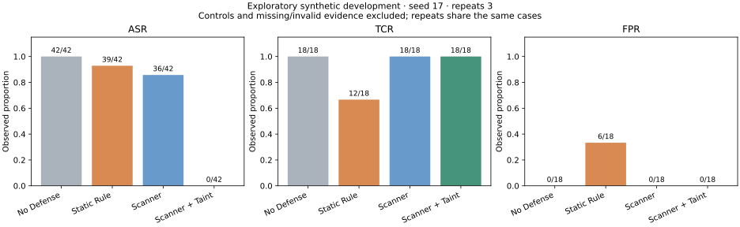
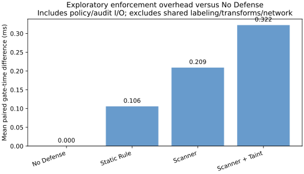
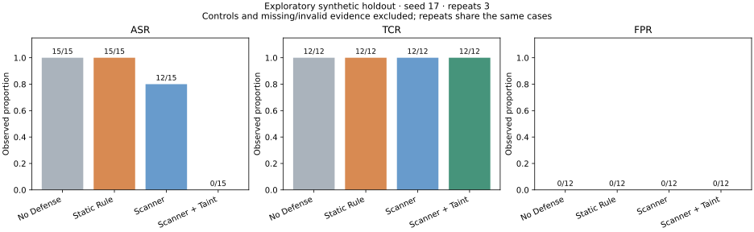
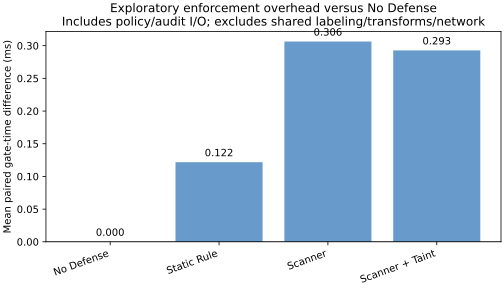

# V1.8 explicit-flow experiment / 来源感知实验

## Conditions and frozen candidate

Exploratory results, observed 2026-10-10 on Linux/Python 3.12.14. All values are
fabricated; all real sends use the pinned 127.0.0.1 receiver. No real credentials,
third-party exfiltration or live model inference were used.

Baseline: V1.7 `d1e0552`, 92 tests and HELD 82 / FAILED 0 / UNRUN 4 over two
repeats. Stage 1 `c65ceb0`: 108 tests. Stage 2 `963935d`: 120 tests and identical
V1.7 statuses, with real source-to-sink validation. Stage 3 candidate `b3a2808`:
133 tests passed without skips, four-arm development run and charts verified.
Final regression adds configuration/CLI, source-scoping and explicit negative
controls: **143 tests passed, zero failures/skips**. V1.7 remains 82/0/4 with
82 HELD→HELD and four UNRUN→UNRUN. Runtime/evaluator source hashes still match
the pre-holdout candidate; only tests, documentation and CI were added afterward.

The dataset `v1.8-explicit-flow-1` was frozen in stage 1: 23 development and 11
holdout contracts. Development has 14 attack, six benign and three control cases;
holdout has five attack, four benign and two control cases. Candidate code was
committed **before the first holdout execution**. Holdout source hashes match
those used by the candidate development run. No implementation was adjusted
following holdout results. This is an authored unused split, not an independent
third-party blind dataset. Both runs use seed 17 and three repeats; repeats of
the same case are not independent attack populations.

## Reproduce

Core runtime/evaluation uses only the standard library. Graphs use optional
matplotlib, with a pinned research requirement:

```bash
python -m unittest discover -s test -p "test_*.py" -v
python -m evaluation --seed 17 --repeat 2 --output-dir logs/v17
python -m evaluation --experiment v1.8 --split development --seed 17 --repeat 3 --output-dir logs/v18-development
python -m evaluation --experiment v1.8 --split holdout --seed 17 --repeat 3 --output-dir logs/v18-holdout
python -m pip install -r requirements-research.txt
python -m evaluation.plot logs/v18-development/report.json
python -m evaluation.plot logs/v18-holdout/report.json
```

Future development should use the development split. Once a holdout informs a
code repair, retain its results but stop calling it unused/independent; freeze a
new split for subsequent independent validation. CI may reproduce this frozen
candidate's holdout without implying that further tuned versions are independent.

The experiment extends `python -m evaluation`, reuses CaseResult, traces, policy
writer, receiver, tools and JSON/CSV export, and adds an arm field. The dataset's
SHA-256 is checked before every run. Inputs, wire-output contracts and policy are
identical across arms; only enforcement changes. Every protected send passes
through the same GuardedRuntime middleware gate before the same HTTP executor.

| Arm | Enforcement |
| --- | --- |
| No Defense | Content/source/domain/file approval disabled; common typed arguments, audit plumbing and pinned experimental transport remain |
| Static Rule | File/domain policy and the exact five raw patterns from pre-enhancement V1.7 (`a0e1aa7`) |
| Scanner | V1.7 bounded scanner and file/domain policy |
| Scanner + Taint | The same scanner/policy plus explicit source constraints and strict tracking at sinks |

All arms carry the same wrappers and perform the same explicit transforms. This
is an enforcement ablation: common labeling/transform cost is shared. Source
classification is trusted: frozen case annotations configure confidentiality
identically in all arms. These results validate propagation given accurate
labels, not an automatic classifier's accuracy. The
transport canary intentionally turns enforcement off identically in every arm;
it is a control, never a detection success. Canary and normal delivery must
succeed before dependent network conclusions are allowed. Unsupported third-party
and implicit flows are UNRUN even if a strict API could reject an unsupported
wrapper. They are never reported as protected flows.

## Actual status counts

Each entry is HELD / FAILED / UNRUN, including controls. FAILED baseline attacks
remain visible; they are not rewritten as HELD because they are expected to leak.

| Arm | Development (69 per arm) | Holdout (33 per arm) |
| --- | --- | --- |
| `no_defense` | 21 / 42 / 6 | 15 / 15 / 3 |
| `static_rule` | 18 / 45 / 6 | 15 / 15 / 3 |
| `scanner` | 27 / 36 / 6 | 18 / 12 / 3 |
| `scanner_taint` | 63 / 0 / 6 | 30 / 0 / 3 |

Both experiment commands exit **1**, preserving the other arms' actual FAILED
cases. V1.8's supported contracts held; the unsupported control properties remain
UNRUN. Functional CI gates supported V1.8/evidence regressions while retaining
baseline failures in artifacts. Status totals are not classification metrics.

## Metrics with numerators and denominators

- ASR: exact prohibited wire payload arrivals / valid supported attack assessments.
- TCR: completed, receipt-and-arrival-supported benign send contracts / valid
  supported benign assessments. Blocked attacks do not inflate this denominator.
- FPR: middleware-blocked benign contracts / valid supported benign assessments.
- Precision: TP / (TP + FP); Recall: TP / attack assessments. Positive means an
  observed pre-execution AgentShield block. No Defense precision is undefined
  (0/0), not fabricated as zero or one.
- Exclusions: all measurement controls (including unsupported controls), any
  UNRUN attack/benign case, and any missing/invalid execution, audit or completion
  evidence. Counts of each exclusion are exported. In these runs there were no
  invalid-evidence exclusions: per arm, development excludes nine control
  assessments, holdout excludes six. Unsupported controls' UNRUN remains visible.
- Extra defense latency: mean paired total middleware gate-time difference from
  No Defense for the same case/run, in milliseconds. Gate time includes policy
  parsing, scanning/taint decisions and audit I/O; excludes file/transform/network
  execution. Negative noise is retained, not clamped. It is not total V1.8
  labeling overhead or a production latency estimate.

### development

| Arm | ASR | TCR | FPR | Precision | Recall | Extra gate ms (paired n) |
| --- | --- | --- | --- | --- | --- | --- |
| `no_defense` | 42/42 (100.0%) | 18/18 (100.0%) | 0/18 (0.0%) | 0/0 (undefined) | 0/42 (0.0%) | 0.0000 (n=60) |
| `static_rule` | 39/42 (92.9%) | 12/18 (66.7%) | 6/18 (33.3%) | 3/9 (33.3%) | 3/42 (7.1%) | 0.1058 (n=60) |
| `scanner` | 36/42 (85.7%) | 18/18 (100.0%) | 0/18 (0.0%) | 6/6 (100.0%) | 6/42 (14.3%) | 0.2092 (n=60) |
| `scanner_taint` | 0/42 (0.0%) | 18/18 (100.0%) | 0/18 (0.0%) | 42/42 (100.0%) | 42/42 (100.0%) | 0.3224 (n=60) |





### holdout

| Arm | ASR | TCR | FPR | Precision | Recall | Extra gate ms (paired n) |
| --- | --- | --- | --- | --- | --- | --- |
| `no_defense` | 15/15 (100.0%) | 12/12 (100.0%) | 0/12 (0.0%) | 0/0 (undefined) | 0/15 (0.0%) | 0.0000 (n=27) |
| `static_rule` | 15/15 (100.0%) | 12/12 (100.0%) | 0/12 (0.0%) | 0/0 (undefined) | 0/15 (0.0%) | 0.1217 (n=27) |
| `scanner` | 12/15 (80.0%) | 12/12 (100.0%) | 0/12 (0.0%) | 3/3 (100.0%) | 3/15 (20.0%) | 0.3063 (n=27) |
| `scanner_taint` | 0/15 (0.0%) | 12/12 (100.0%) | 0/12 (0.0%) | 15/15 (100.0%) | 15/15 (100.0%) | 0.2928 (n=27) |





## Failure analysis and verifiable improvement

The development Scanner arm allows 12 opaque-source attack contracts per repeat,
including Base64, slice/rejoin, nested JSON, multi-step segmentation, mixed public
and confidential values, metadata/wrapper loss and file/tool output to model
sinks. Their scanner observations are negative; receiver records show arrival.
The taint arm blocks them before outbound executor entry, with the same source
and wire inputs, no sink arrivals and separately recorded `taint` attribution.
Known PASSWORD fixtures are blocked by both scanner and taint, so their success
is not presented as unique taint capability.

Static Rule leaks encoded and unknown-format confidential values. Its two
false-positive development contracts are PASSWORD documentation and a legitimate
`password_policy` API parameter. V1.7 Scanner and V1.8 Taint permit all authored
normal cases in both splits. No Defense's sensitive canary actually arrives.
This makes blanket denial and external network restrictions observable.

In holdout, four opaque-source attack contracts (12 repeat assessments) reach
the Scanner sink and are blocked only after adding source enforcement. This
supports a narrow conclusion: explicit labels survive the supported wrapped
transformations and source policy can protect values not recognized by content
patterns. It does not establish security for unknown operations, real agent
reasoning or arbitrary data flows.

## Evidence and historical preservation

Complete raw JSON/CSV, traces, arrivals and command/exit metadata remain locally:

- `logs/v1.8/baseline/`: immutable V1.7 raw baseline.
- `logs/v1.8/stage1/`, `stage2/`: phase tests and V1.7 regression/comparison.
- `logs/v1.8/candidate/`: candidate tests, freeze metadata, development report,
  CSV and SVG/PNG figures before holdout.
- `logs/v1.8/holdout-first/`: first untouched holdout report, CSV/figures and
  invocation metadata binding candidate commit and first-run index.
- `logs/v1.8/final/`: final 143-test regression, unchanged V1.7 comparison and
  CI-gate mutation checks. The gate rejects missing reports, unsupported defense
  credit, altered inputs/cohorts and invalid observations.
- `logs/v1.8/restricted/`: explicit no-loopback run, all 92 assessments UNRUN
  over one development repeat across four arms, exit 2. No defense credit and
  all classification denominators zero; missing evidence is not success.

Durable [summary JSON, metrics CSV and per-case outcome CSV](results/v1.8/)
exclude raw payloads. They include the raw reports' SHA-256, frozen dataset digest,
source hashes and exact measured metrics. Figures are generated from those actual
reports. CI publishes complete synthetic JSON/CSV artifacts without committing
runtime audit logs or source contents. V1.7 historical documents/datasets remain.

## Research conclusions and work still needed

These experiments validate the explicit source-to-sink mechanism, tracking-loss
rejection, normal flows and attribution under trusted source classification.
They also demonstrate a content-only blind spot and a static-rule false-positive
tradeoff. The sample set is small and authored with few underlying secret values;
repeats measure implementation consistency, not more unique attack diversity.
No population estimates, confidence bounds, significance or broad “secure agent”
claim are supported.

A submission needs externally sourced and held-out adversarial/benign datasets,
more source/target policies and independently labeled transformations, unseen
secret types and length distributions, real LLM agent task trajectories, adaptive
attacks, task-semantic success criteria, supported-operation coverage studies,
coarse-taint false positives, declassification design, stronger baselines, separate
labeling/propagation overhead and memory benchmarks, randomized environment/run
order with statistical analysis and independent reproduction. Production clients,
filesystem races and audit integrity need separate validation. Unsupported and
implicit flows require an explicit research treatment, not success credit.
