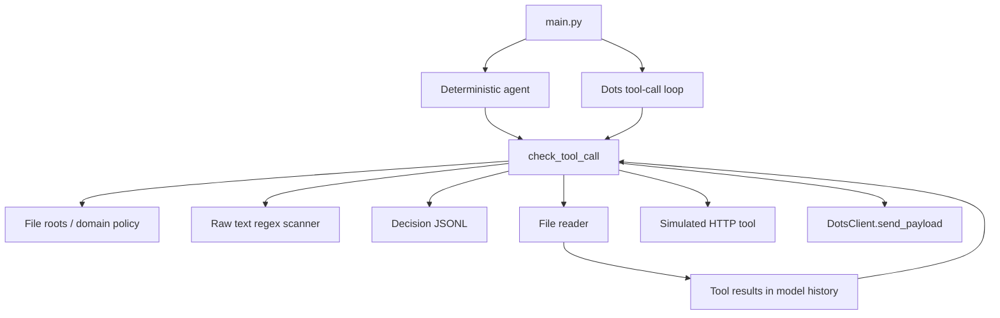

# V1.7 review and staged implementation plan

Reviewed on 2026-10-10 against `main` at
`d6702767c5e20b4ede8e764e29cb412b96a2b74a`. This is a source review and an
offline, synthetic-data assessment, not a security certification.

## Architecture and coverage

Both supplied agents check file reads and HTTP sends before calling their
executors. The Dots agent serializes the next model request and checks that
payload, including previous tool results, before sending it. There is no
process-wide mediation: directly imported tools and `DotsClient.send_payload`
can run without this gate. The capability registry resolves aliases to policy
branches; it does not implement or prove executor binding for those aliases.

Reviewed all runtime modules in `agent/`, `model/`, `security/`, `tools/`, the
CLI, policy, PowerShell launcher, four original test modules, CI, both READMEs,
CHANGELOG, SECURITY, license and ignore rules. The GIF is presentation material,
not execution evidence. The original suite has 30 tests, although the READMEs
still say eighteen. All 30 passed on Python 3.12.14 before changes.

## Risk register, ordered by severity

Severity assumes an untrusted model or untrusted tool output and an allowed
outbound destination. The Python process, evaluator, policy and filesystem
owner are trusted. An adversary controlling the interpreter is out of scope.

| Priority | Finding and evidence | Consequence | Initial action |
| --- | --- | --- | --- |
| High | The scanner searches raw strings for five patterns. Synthetic Base64, fully percent-encoded markers and an RSA private-key header are not detected. | Recognizable sensitive content can cross an allowed output boundary after conversion. | Preserve these as independently observed failing cases; add bounded structured/encoded scanning next. |
| High | `urlopen` in the live Dots client can follow redirects; domain policy checks only the initial URL and does not pin resolved addresses. | Policy approval alone does not constrain every live network hop. | No live provider testing in this iteration. Add a separately constrained loopback transport that never resolves DNS or follows redirects. The existing live Dots path remains outside its guarantee. |
| High | Tools and the Dots client are callable directly. Registry documentation suggests a shared executor, but only capability resolution is implemented. | Middleware coverage depends on caller discipline and cannot protect arbitrary Python code. | Declare the integration boundary; use an explicit executor trace and an undefended control in evaluation. Central dispatch is a later stage. |
| High | File checks compare a lexical blocked name separately from resolved allowed roots. A benign alias to a protected filename may pass the original middleware. Path resolution may raise. | Protected-file checks can disagree with the file actually opened. | Check lexical and resolved names, carry the approved absolute path to the executor, and reject resolution errors. This does not close filesystem races. |
| Medium | Malformed URLs can raise; non-HTTP schemes, userinfo and invalid ports are accepted based only on hostname. Some arguments are implicitly converted with `str`. Invalid UTF-8 policy decoding raises. | Rejection and audit behavior are inconsistent on malformed input. | Validate types, URL syntax, domains and resolution failures; return explicit audited decisions. |
| Medium | Any model final message makes `run_llm_agent` return `True`, even with no requested action evidence. The deterministic CLI returns zero after a block. | Process success or a model claim cannot establish task completion. | Evaluate completion independently using actual effects; keep a failing no-effect completion case. Do not change CLI semantics silently. |
| Medium | Audit records are permission decisions written before execution, with no operation identifier, completion event or integrity protection. Files are writable and truncatable. Caller-controlled agent/tool metadata can contain sensitive text. | ALLOW does not prove execution; logs do not prove tamper resistance or universal data minimization. | Cross-check decision records against separate execution/receiver evidence; report tamper verification as UNRUN. Completion logging and metadata minimization are later work. |
| Medium | Non-mapping tool-call entries are skipped. Internal names such as `http` can receive an ALLOW decision but are not dispatched by the LLM agent. Tool-call count within one response is unbounded. | Protocol errors, dispatch decisions and audit events can disagree. | Add explicit protocol/dispatch validation and per-run budgets in a later narrowly scoped change. |
| Medium | The scanner blocks benign documentation containing `PASSWORD`; scanning serialized tool definitions can also reject benign contexts. | Blocking everything could produce apparently strong defense results while preventing useful work. | Include benign controls and record failed benign cases; measure FPR separately in the benchmark stage. |
| Medium | File resolution is followed by a separate open; file errors and binary decoding are only partly handled. Audit writes are not signed or fsynced. | Races and crash durability are not covered by current guarantees. | Catch decoding failures in the LLM flow now; describe atomic-open and durability limits explicitly. |

## Test independence and evidence gaps

The original tests use the same scanner markers and default policy as the
implementation. Several assertions inspect a decision, printed text or a fake
client rather than a performed effect. The normal HTTP tool performs no request,
and the secret-file test does not instrument the reader to prove non-execution.
These tests are useful regression checks, but not independent evidence of an
exfiltration boundary. There were no real receiver observations, encoded cases,
false-positive measurement, audit-write failure tests, clean-copy execution, or
proof of action-based completion.

The new evaluator must define expectations from the synthetic case contract,
not from scanner patterns or the default policy. A successful undefended canary
and a benign delivery must prove that the sink is reachable. If transport or
environment restrictions prevent that control, network claims are **UNRUN**.
A transport rejection must be labeled **transport**, never AgentShield.
An ALLOW audit is permission evidence, not a completion receipt.

## Stages and acceptance gates

1. **Review and policy robustness.** Preserve the existing CLI, fix malformed
   inputs and canonical path handling, add regression tests, and commit
   independently. Keep the complete original test suite passing.
2. **V1.7 independent evaluation (current iteration).** Add synthetic case
   contracts, ordered traces, real loopback receipts, audit cross-checks,
   HELD/FAILED/UNRUN attribution, isolated clean-copy execution, fixed seeds,
   repeat runs and JSON/CSV export. A small optional loopback-only HTTP executor
   is a measurement prerequisite, not a general outbound HTTP feature. Each
   component receives tests and an independent commit. Known defense failures
   must remain visible in the report and CI artifact.
3. **Scanner enhancement.** Add bounded JSON-field, URL-decoding and Base64
   inspection, common key/token/private-key families, split/rejoined controls,
   tool-result and multi-round propagation cases. Define maximum decoding
   depth/bytes. Track both attack and benign outcomes; do not achieve security
   by blanket network denial.
4. **Explicit taint MVP.** Introduce immutable labeled values with source IDs
   and explicit concat/serialize/encode operations. Track file and tool sources
   through these operations to HTTP/model sinks. Raw-string escape, implicit
   flows, arbitrary Python transforms and model paraphrase must be documented
   as untracked rather than advertised as protected.
5. **Research benchmark.** Freeze/version an attack and benign dataset and
   held-out transformations. Compare No Defense, Static Rule, Scanner and
   Scanner + Taint using the same executors and sinks. Derive ASR, TCR, FPR,
   precision/recall and latency from per-case receipts, report denominators,
   repetitions, missing observations and confidence limits. Export CSV/JSON,
   generate plots from those exports, and retain failure explanations.

Stage 2 results are case assessments, not paper-grade population metrics. No
claim of complete information-flow security, real-provider safety or
prompt-injection resistance is supported by this iteration.
