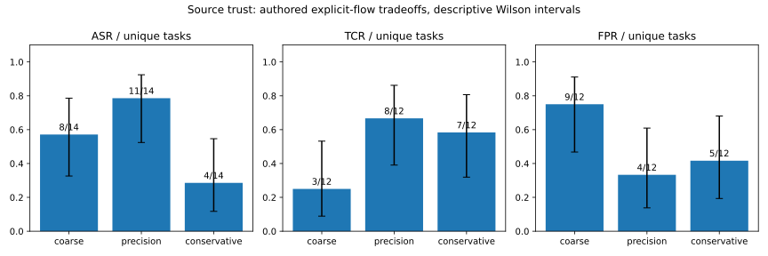

# V1.10 来源可信性与安全—可用性实验

V1.10 `f7c706f40e52a76c7fa9977dc2a72a9fe71ca359` 的 212 个原有文件完整冻结，
包括代码、数据集、文档、CI 和历史实验结果。本次仅新增后续研究文件，
没有启动 V2.0，也没有改变生产流程的默认策略。

按预先记录的协议，先冻结来源分类任务，再实现研究用保守 MIXED 适配器，
随后比较三个策略。任务数据集版本 `v1.10-source-trust-1`，SHA-256 为
`78c44607590906fabc730ffa8b495ce58b411c48dab8c17610a1a32bd44797cc`。
干净实现提交为 `cad7c1e08dd2d7631f0c0e73dcd8672bfd88891c`。

## 实验条件与真实结果

28 个人工构造任务：14 个攻击、12 个正常任务、2 个测量控制；seed=17，
重复 3 次，三种策略共 252 次真实执行。三个策略共享输入、来源声明、
转换步骤、工具、扫描器和固定 127.0.0.1 接收端，不做任何解密放行。
控制组在每个策略中关闭内容防御，用公开与敏感合成数据确认接收端可达，
排除在 ASR/TCR/FPR 分母之外。

| 策略 | HELD / FAILED / UNRUN | ASR | TCR | FPR | Precision | Recall |
|---|---|---|---|---|---|---|
| 粗粒度 | 33 / 51 / 0 | 24/42 = 57.1% | 9/36 = 25.0% | 27/36 = 75.0% | 18/45 = 40.0% | 18/42 = 42.9% |
| 当前精细化 | 39 / 45 / 0 | 33/42 = 78.6% | 24/36 = 66.7% | 12/36 = 33.3% | 9/21 = 42.9% | 9/42 = 21.4% |
| 保守精细化 | 57 / 27 / 0 | 12/42 = 28.6% | 21/36 = 58.3% | 15/36 = 41.7% | 30/45 = 66.7% | 30/42 = 71.4% |

ASR 根据敏感载荷实际到达接收端计算；TCR 根据正常输出的真实执行、
匹配接收内容和 HTTP 回执计算；FPR 是正常任务在发送前被中间件阻断的比例。
Precision/Recall 使用来源策略与污点阻断的实际 TP/FP/FN，不能证明分类声明本身正确。
没有预设零泄露，所有 123 项 FAILED 都保留在完整报告中；证据校验通过不等于防御全通过。

重复执行不增加独立攻击数量。按唯一任务折叠后的 ASR 分别为 8/14、11/14、4/14，
TCR 为 3/12、8/12、7/12，FPR 为 9/12、4/12、5/12。
同一任务若任一次泄露/误阻断即计入，正常任务全部重复完成才计入完成。
JSON 和图表给出唯一任务的描述性 Wilson 区间；成对样本仍相关，
这些区间不是针对真实攻击总体的置信保证。

## 来源分类错误的影响

这里注入的是已知标签错误，测量其后果；没有训练自动分类器，不能从此估计真实部署的漏标发生率。
下表按唯一任务列出攻击泄露数/攻击数；完整的正常任务 FPR 及重复计数见 source-profiles.csv。

| 来源条件 | 粗粒度 ASR | 当前精细化 ASR | 保守精细化 ASR |
|---|---|---|---|
| 正确字段标签 | 0/1 | 0/1 | 0/1 |
| 漏标、MIXED 无字段声明 | 3/3 | 3/3 | 0/3 |
| Schema 不完整：嵌套、列表、工具、Unicode 字段 | 3/4 | 4/4 | 0/4 |
| 显式字段错标为 PUBLIC | 0/1 | 1/1 | 1/1 |
| 错误整源 PUBLIC | 1/1 | 1/1 | 1/1 |
| PUBLIC 父容器新增敏感子字段 | 0/1 | 1/1 | 1/1 |
| 来源缺失，BLOCK | 0/1 | 0/1 | 0/1 |
| UNKNOWN，BLOCK | 0/1 | 0/1 | 0/1 |
| 显式 UNKNOWN ALLOW | 1/1 | 1/1 | 1/1 |

保守适配器仅把 MIXED 未声明值的 `default_sensitive` 改为 True，
保持原声明不变并另记有效策略。它比当前精细化多阻断 7 个不同攻击任务，
包含 Base64/URL 编码和工具来源；对应字符串在开启的扫描器中均未命中，
阻断归因为污点策略，发生在实际 HTTP 执行之前。

这项变化也多误阻断 1 个未声明但正常的字段。错误 PUBLIC 字段、PUBLIC 父容器
和整源 PUBLIC 仍会覆盖默认值，保守策略不能纠正它们。UNKNOWN/MISSING 的
BLOCK 或 REQUIRE_REVIEW 会同时拒绝正常未知数据：这一可用性成本已计入 FPR。
粗粒度在另外两个错标/父容器任务中靠其他字段的污点并集阻断，同时误阻断更多正常输出。
目前没有足够证据选择一个生产默认策略。

## 可复现与回归

新增独立校验器核验全部冻结输入、来源执行、转换链、策略处理、审计决策、
接收内容、回执、阻断模块、指标分子/分母及成本缺失。它不导入防御实现，
允许真实 FAILED；对于缺少或无效观测，CI 拒绝将报告作为完整实验使用。
报告篡改测试覆盖删失败样本、改成功状态、改分母、伪造执行/接收/审计和误报归因。

完整单元测试 **286 通过、0 失败**，其中新增适配器 6 项、实验与校验器 9 项。
旧 CLI 独立评估 **82 HELD、0 FAILED、4 UNRUN**，后两项未支持条件各重复两次，
分别为审计篡改验证和隐式信息流。初次开发运行、校验前运行和干净提交运行均保存，
不覆盖原有 V1.10 数据。新 GitHub Actions 在 Python 3.10/3.11/3.12 上运行完整回归和证据门禁。

干净运行每组 78 个非控制观测的输出检查平均耗时分别为 1.161、0.927、0.775 ms。
这只是已观测策略门禁耗时，未包含来源读取、转换、模型和网络耗时。
本研究没有配对 No Defense 主实验，额外防御延迟保持 null；本机小样本耗时不能证明性能优劣。

## 后续顺序与未完成验证

真实 Agent 阶段仍缺少可用 DeepSeek/Qwen 凭据。本次对现有真实模型入口的默认关闭验证
得到 **36 UNRUN、0 次请求**；旧 36 项 UNRUN 未被重写，也未纳入安全有效性指标。
获得安全配置的凭据、可核实模型名称和费用预算后，才运行受控多轮调用与间接注入。
应先预登记小规模任务、成功契约、最大轮数/调用数和停止条件，保留原始响应、工具
采纳、模型边界和接收证据，分别报告攻击采纳率和外泄率。

为下一阶段留档了 AgentDojo 外部作者的两个未改写攻击源模块及 MIT 许可证，
固定上游提交 `089ed468cf3ed0322acc66b0211f26d9d90dbf60`，逐文件核对 SHA-256。
文件保存为 `.py.txt`，没有导入或执行；适配器和基准实验均 **UNRUN**。
看过这些材料后不能把它们称为盲测，不能报告官方 AgentDojo 分数。
本次 PUBLIC 父容器扩展攻击由作者构造，属于适应性开发案例，也不是独立验证。

独立研究验证仍需外部作者未用于开发的攻击、冻结后的适配协议、真实 Agent
运行、多种字段分类错误率/Schema 演变条件、更多任务与模型，并记录失败后再调整
实现会使哪些样本退回开发集。当前结果支持一个有限结论：来源标签的语义正确性
不由完整性签名保证；保守 MIXED 默认可以改善特定漏标防御，同时付出可用性成本。
它不支持完整信息流安全、真实模型防御有效或论文级泛化结论。

## English note

V1.10's entire original 212-file tree remains frozen. The follow-up compares
coarse, unchanged precision, and MIXED-default-sensitive precision on the same
28 authored contracts, with the scanner active in every primary strategy and
actual pinned-loopback receiver evidence. The 252 observed assessments contain
129 HELD, 123 FAILED and no UNRUN; every failure is retained.

On unique tasks, ASR is 8/14, 11/14 and 4/14; TCR is 3/12, 8/12 and 7/12;
FPR is 9/12, 4/12 and 5/12. Conservative MIXED prevents seven additional attack
tasks versus current precision but adds one false block. Wrong explicit PUBLIC
labels and PUBLIC-parent inheritance remain exploitable. These injected-label
development cases establish a local tradeoff, not classifier accuracy or
population-level security. Repeated and paired tasks are correlated.

All 286 unit tests pass. Genuine model observations remain 36 UNRUN with zero
requests. Pinned MIT-licensed AgentDojo source templates are intake-only UNRUN
material, not an adapted or independently executed external benchmark. Genuine
agents and independent external validation remain the next conditional stages.
